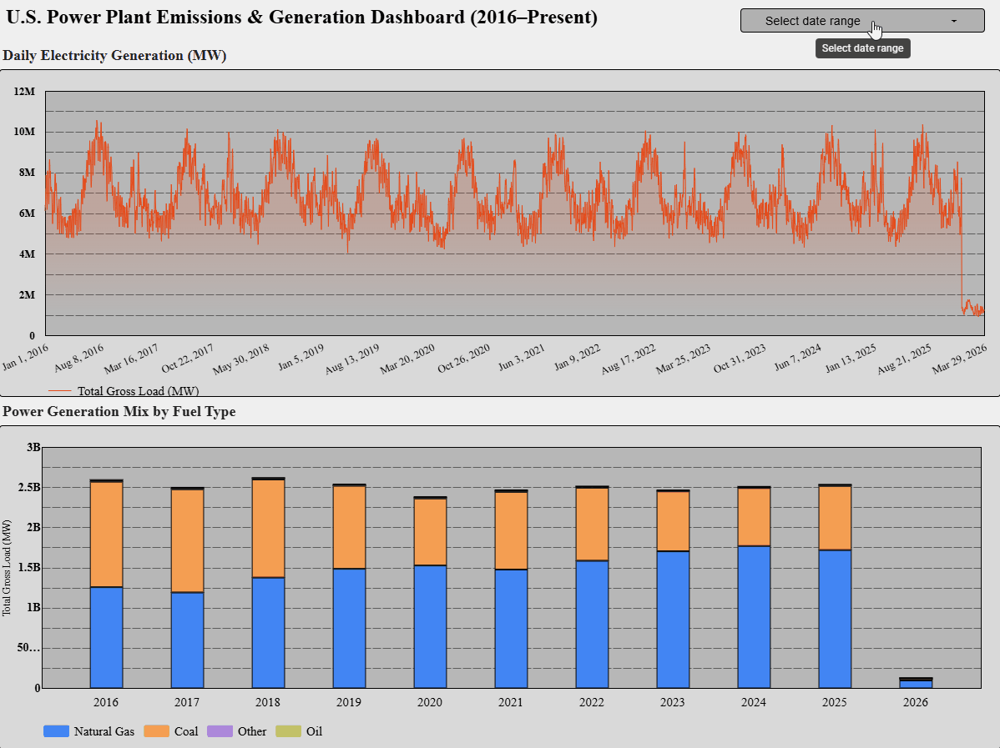
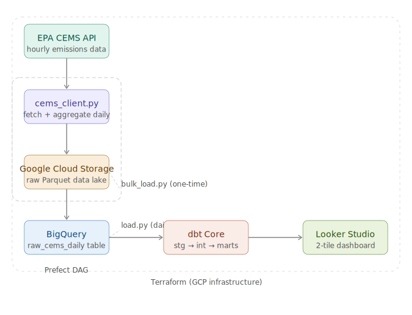

# U.S. Power Plant Emissions & Generation Pipeline

An end-to-end data engineering pipeline that ingests EPA CEMS (Continuous Emissions Monitoring System) data for all 50 U.S. states, processes and transforms it, and visualizes electricity generation and CO2 emissions trends from 2016 to present.

## Dashboard



🔗 [View Live Dashboard](https://datastudio.google.com/reporting/85c035b2-dd9a-41bf-9a4b-05e9c60b02ad)

## Architecture



The pipeline consists of the following stages:

**Ingestion** — `cems_client.py` fetches hourly data from the EPA CAMPD API for all 50 states, aggregates it to daily granularity per facility unit, and uploads Parquet files to Google Cloud Storage. A one-time bulk load (`bulk_load.py`) backfills historical data from 2016. The daily Prefect flow (`dag.py`) re-fetches the last 90 days of data to capture late EPA submissions.

**Storage** — Raw Parquet files are stored in GCS using a Hive-partitioned structure: `raw/cems/state={state}/year={year}/month={month}/`. This mirrors BigQuery's partitioning scheme and makes the data lake easy to navigate.

**Loading** — `load.py` loads Parquet files from GCS into BigQuery. The bulk load uses a wildcard URI to load all historical files in a single BigQuery job. The incremental daily load lists files by year/month and appends new rows.

**Transformation** — dbt Core transforms the raw BigQuery table through three layers: staging (cleaning and type casting), intermediate (aggregating to state/fuel/date level), and marts (final tables consumed by the dashboard).

**Orchestration** — Prefect orchestrates the daily pipeline: ingest → load → dbt run → dbt test. The flow runs on a daily schedule at 6am UTC.

**Visualization** — Looker Studio connects directly to the BigQuery mart tables and displays two dashboard tiles.

## Dataset

**Source:** [EPA CAMPD API](https://api.epa.gov/easey/streaming-services/emissions/apportioned/hourly)

The EPA requires every major U.S. power plant to install continuous emissions monitoring sensors that report hourly data. This dataset covers all 50 states from 2016 to present and includes:

| Field | Description |
|---|---|
| `gross_load_mw` | Electricity generated (MW) |
| `co2_mass_tons` | CO2 emissions (tons) |
| `so2_mass_lbs` | SO2 emissions (lbs) |
| `nox_mass_lbs` | NOx emissions (lbs) |
| `heat_input_mmbtu` | Fuel energy consumed (MMBtu) |
| `primary_fuel` | Fuel type (natural gas, coal, oil, etc.) |

**Scale:** ~15 million rows covering ~6,150 state/month combinations across all 50 states.

## Dashboard Tiles

**Tile 1 — U.S. Daily Electricity Generation Over Time**
A time series chart showing total electricity generation (MW) by state from 2016 to present. Includes a date range control for filtering.

**Tile 2 — U.S. Power Generation Mix by Fuel Type**
A stacked bar chart grouped by year showing how the U.S. power generation mix has shifted across fuel categories. The decline of coal and growth of natural gas is clearly visible over the 2016–2025 period.

## Technologies

| Layer | Tool |
|---|---|
| Cloud | Google Cloud Platform (GCP) |
| Infrastructure as Code | Terraform |
| Data Lake | Google Cloud Storage |
| Data Warehouse | BigQuery (partitioned by day, clustered by state + facility) |
| Ingestion | Python (requests, pandas, pyarrow) |
| Orchestration | Prefect |
| Transformation | dbt Core |
| Dashboard | Looker Studio |

## BigQuery Optimization

The `raw_cems_daily` table is:
- **Partitioned by `date` (DAY)** — queries filtering by date range only scan relevant partitions, drastically reducing cost and query time
- **Clustered by `state` and `facility_id`** — the most common filter dimensions in dashboard queries, which means BigQuery can skip irrelevant blocks within each partition

## Project Structure

```
oil-supply-and-demand-pipeline/
├── credentials/            # GCP service account key (gitignored)
├── pipeline/
│   ├── cems_client.py      # EPA API wrapper + hourly→daily aggregation
│   ├── bulk_load.py        # One-time historical backfill (2016→present)
│   ├── ingest.py           # Daily incremental fetch (90-day window)
│   ├── load.py             # GCS → BigQuery loader
│   └── dag.py              # Prefect flow (ingest → load → dbt)
├── terraform/
│   ├── main.tf
│   ├── variables.tf
│   └── modules/
│       ├── gcs/            # GCS bucket
│       └── bigquery/       # BigQuery dataset + table schema
├── transforms/             # dbt project
│   └── models/
│       ├── staging/        # stg_cems_daily
│       ├── intermediate/   # int_cems_aggregated
│       └── marts/          # mart_emissions_over_time, mart_emissions_by_fuel
├── docs/
│   ├── architecture.svg
│   └── LookerScreenRecord.gif
├── .env.example
├── Makefile
└── requirements.txt
```

## Reproducing This Project

### Prerequisites

- GCP account with billing enabled
- Terraform >= 1.0
- Python 3.12+
- Free EPA CAMPD API key — register at [epa.gov/power-sector/cam-api-portal](https://www.epa.gov/power-sector/cam-api-portal#/api-key-signup)

### Setup

**1. Clone the repo**
```bash
git clone https://github.com/KarloVlahek/oil-supply-and-demand-pipeline
cd oil-supply-and-demand-pipeline
```

**2. Create a virtual environment and install dependencies**
```bash
make setup
```

Or manually:
```bash
pip install uv
uv venv .venv
source .venv/bin/activate  # Windows: .venv\Scripts\activate
uv pip install -r requirements.txt
```

**3. Configure environment variables**

Copy `.env.example` to `.env` and fill in your values:
```bash
cp .env.example .env
```

```
EIA_API_KEY=your_epa_api_key_here
GCP_PROJECT_ID=your_gcp_project_id
GCS_BUCKET_NAME=your_gcs_bucket_name
BQ_DATASET_ID=oil_supply_demand_dataset
CEMS_API_KEY=your_epa_api_key_here
```

**4. Set up GCP credentials**

Create a GCP service account with BigQuery Admin and Storage Admin roles, download the JSON key, and save it to `credentials/gcp-key.json`.

**5. Provision cloud infrastructure**
```bash
make infra-init
make infra-apply
```

This creates the GCS bucket and BigQuery dataset with the correct schema, partitioning, and clustering.

**6. Configure dbt**

Create `~/.dbt/profiles.yml` with the following (replacing the keyfile path with your absolute path):
```yaml
transforms:
  outputs:
    dev:
      dataset: oil_supply_demand_dataset
      job_execution_timeout_seconds: 300
      job_retries: 1
      keyfile: /absolute/path/to/credentials/gcp-key.json
      location: US
      method: service-account
      priority: interactive
      project: your_gcp_project_id
      threads: 4
      type: bigquery
  target: dev
```

**7. Run the historical bulk load**

This fetches all data from 2016 to present for all 50 states. Estimated runtime: 3–4 hours.
```bash
make bulk-load
```

**8. Load bulk data into BigQuery**
```bash
python pipeline/load.py
```

**9. Run dbt transformations**
```bash
make dbt-all
```

**10. Run the daily pipeline**
```bash
python pipeline/dag.py
```

This runs the Prefect flow once. To activate the daily schedule, keep this process running on a server — it triggers at 6am UTC every day.

### Makefile Reference

```bash
make setup        # create venv and install dependencies
make infra-init   # terraform init
make infra-apply  # provision GCP resources
make bulk-load    # run one-time historical backfill
make dbt-run      # run dbt models
make dbt-test     # run dbt tests
make dbt-all      # run dbt models + tests
```

## Data Latency

EPA CEMS data is typically published 30–90 days behind real time as power plants submit and EPA validates their data. The daily Prefect job re-fetches the last 90 days of data on every run to capture late submissions. Dashboard visualizations are most reliable for data older than 90 days.